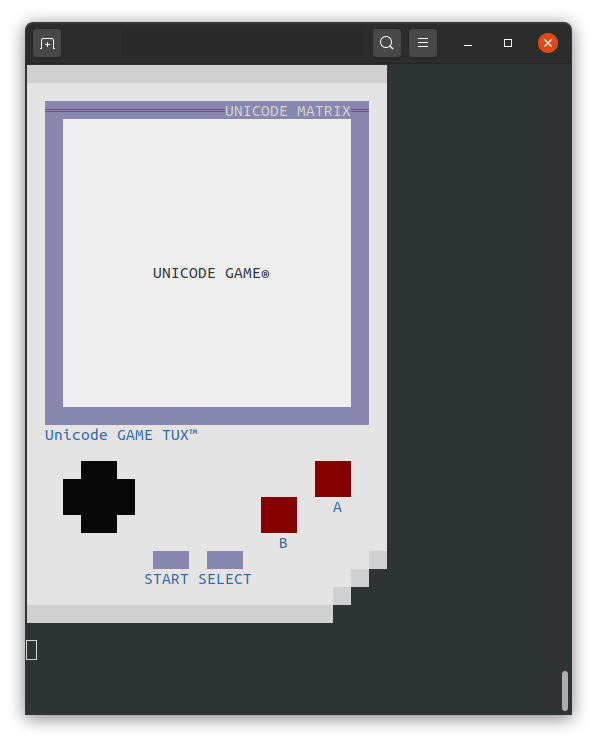

# unicode-game
Unicode game

A small sandbox game into your terminal...

Requirements
- NodeJS
- An emoji compatible terminal (for Windows look for the new powershell)

Installation
- Launch a new terminal
- Move to game directory
- Enter the following command : 
  npm i -S simplex-noise
- Start the game like this : 
  node run.js
